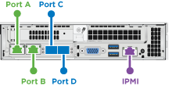

= Installare nodi storage H-Series
:allow-uri-read: 
:icons: font
:imagesdir: ../media/

[role="lead"]
Prima di iniziare a utilizzare il sistema storage all-flash, è necessario installare e configurare correttamente i nodi di storage.

TIP: Vedere link:../media/hseries_isi.pdf["poster"^] per una rappresentazione visiva delle istruzioni.

* <<Diagrammi del flusso di lavoro>>
* <<Preparazione per l'installazione>>
* <<Montare le guide>>
* <<Installare e cablare i nodi>>
* <<Configurare i nodi>>
* <<Creare un cluster>>

== Diagrammi del flusso di lavoro

I diagrammi del flusso di lavoro forniscono una panoramica generale delle fasi di installazione. Le fasi variano leggermente a seconda del modello della serie H.

=== H410S

image::../media/h410s_isi_workflow.png[Flusso di lavoro di installazione di H410S]

=== H610S

NOTE: I termini "nodo" e "chassis" sono utilizzati in modo intercambiabile nel caso di H610S, perché nodo e chassis non sono componenti separati, a differenza del caso di uno chassis 2U a quattro nodi.

image::../media/h610s_isi_workflow.png[Workflow di installazione di H610S]

== Preparazione per l'installazione

In preparazione dell'installazione, inventariare l'hardware spedito e contattare il supporto NetApp se alcuni degli elementi sono mancanti.

Assicurarsi di disporre dei seguenti elementi nella posizione di installazione:

* Spazio rack per il sistema.

[cols="2*"]
|===
| Tipo di nodo | Spazio rack 

| Nodi H410S | Due unità rack (2U) 

| H610S nodi | Un'unità rack (1U) 
|===
* Cavi o ricetrasmettitori a collegamento diretto SFP28/SFP+
* Cavi Cat5e o superiori con connettore RJ45
* Uno switch KVM (Keyboard, Video, mouse) per configurare il sistema
* Chiavetta USB (opzionale)

TIP: L'hardware spedito dipende da quello che si ordina. Un nuovo ordine 2U a quattro nodi include chassis, pannello, kit guide di scorrimento, dischi, nodi di storage, e cavi di alimentazione (due per chassis). Se si ordinano nodi di storage H610S, le unità vengono installate nello chassis.

CAUTION: Durante l'installazione dell'hardware, assicurarsi di rimuovere tutto il materiale di imballaggio e l'imballaggio dall'unità. In questo modo si eviteranno il surriscaldamento e lo spegnimento dei nodi.

== Montare le guide

L'ordine hardware fornito include un set di guide di scorrimento. Per completare l'installazione della guida, è necessario un cacciavite. Le fasi di installazione variano leggermente per ciascun modello di nodo.

TIP: Installare l'hardware dalla parte inferiore del rack fino alla parte superiore per evitare che l'apparecchiatura si rovescii. Se il rack include dispositivi di stabilizzazione, installarli prima di installare l'hardware.

* <<H410S>>
* <<H610S>>

=== H410S

I nodi H410S sono installati in chassis 2U a quattro nodi serie H, fornito con due set di adattatori. Se si desidera installare lo chassis in un rack con fori rotondi, utilizzare gli adattatori appropriati per un rack con fori rotondi. Le guide per i nodi H410S si adattano a un rack con una profondità compresa tra 29 e 33.5 pollici. Quando la guida è completamente contratta, è lunga 28 pollici e le sezioni anteriore e posteriore della guida sono tenute insieme da una sola vite.

CAUTION: Se si installa il telaio su una guida completamente contratta, le sezioni anteriore e posteriore della guida potrebbero separarsi.

.Fasi
. Allineare la parte anteriore della guida con i fori sul montante anteriore del rack.
. Spingere i ganci sulla parte anteriore della guida nei fori sul montante anteriore del rack, quindi abbassarli fino a quando i perni caricati a molla non scattano nei fori del rack.
. Fissare la guida al rack con le viti. Di seguito viene illustrata la guida sinistra collegata alla parte anteriore del rack:
+
image::../media/h410s_rail.gif[Installazione su guida per 2U]

. Estendere la sezione posteriore della guida fino al montante posteriore del rack.
. Allineare i ganci sul retro della guida con i fori appropriati sul montante posteriore, assicurandosi che la parte anteriore e posteriore della guida siano allo stesso livello.
. Montare la parte posteriore della guida sul rack e fissarla con le viti.
. Eseguire tutte le operazioni descritte sopra per l'altro lato del rack.

=== H610S

Di seguito viene illustrata l'installazione delle guide per un nodo di storage H610S:

image::../media/h610s_rail_isi.gif[Installazione su guida per nodo storage H610S.]

TIP: Sul modello H610S sono presenti guide di destra e di sinistra. Posizionare il foro della vite verso il basso in modo che la vite a testa zigrinata H610S possa fissare il telaio alla guida.

== Installare e cablare i nodi

Il nodo di storage H410S viene installato in uno chassis 2U a quattro nodi. Per H610S, installare lo chassis/nodo direttamente sulle guide nel rack.

CAUTION: Rimuovere tutto il materiale di imballaggio e l'imballaggio dall'unità. In questo modo si evitano il surriscaldamento e lo spegnimento dei nodi.

* <<H410S>>
* <<H610S>>

=== H410S

.Fasi
. Installare i nodi H410S nello chassis. Ecco un esempio di vista posteriore di uno chassis con quattro nodi installati:
+
image::../media/sf_isi_chassis_rear.png[Questa figura mostra il retro di una 2U]

+

WARNING: Prestare attenzione durante il sollevamento e l'installazione dell'hardware nel rack. Uno chassis vuoto a due rack (2U) e quattro nodi pesa 24.7 kg (54.45 lb) e un nodo pesa 3.6 kg (8.0 lb).

. Installare i dischi.
+
image::../media/hci_stor_node_ssd_bays.gif[Questa figura mostra la parte anteriore della 2U]

. Collegare i nodi.
+

IMPORTANT: Se le prese d'aria sul retro del telaio sono bloccate da cavi o etichette, possono verificarsi guasti prematuri dei componenti dovuti al surriscaldamento.

+

+
** Collegare due cavi CAT5e o superiori nelle porte A e B per la connettività di gestione.
** Collegare due cavi o ricetrasmettitori SFP28/SFP+ nelle porte C e D per la connettività dello storage.
** (Opzionale, consigliato) collegare un cavo CAT5e alla porta IPMI per la connettività di gestione out-of-band.

. Collegare i cavi di alimentazione alle due unità di alimentazione per chassis e collegarle alla PDU da 240 V o alla presa di corrente.
. Accendere i nodi.
+

NOTE: L'avvio del nodo richiede circa sei minuti.

+
image::../media/hci_poweron_isg.gif[Questa figura mostra i pulsanti di accensione sui nodi della 2U]

=== H610S

.Fasi
. Installare il telaio H610S. Di seguito viene riportata un'illustrazione per l'installazione del nodo/chassis nel rack:
+
image::../media/h610s_chassis_isi.gif[Mostra il nodo/chassis H610S installato nel rack.]

+

WARNING: Prestare attenzione durante il sollevamento e l'installazione dell'hardware nel rack. Uno chassis H610S pesa 18.4 kg (40.5 lb).

. Collegare i nodi.
+

IMPORTANT: Se le prese d'aria sul retro del telaio sono bloccate da cavi o etichette, possono verificarsi guasti prematuri dei componenti dovuti al surriscaldamento.

+
image::../media/h600s_isi_noderear.png[Questa figura mostra il cablaggio del nodo di storage H610S.]

+
** Collegare il nodo a una rete 10/25GbE utilizzando due cavi SFP28 o SFP+.
** Collegare il nodo a una rete 1GbE utilizzando due connettori RJ45.
** Collegare il nodo a una rete 1GbE utilizzando un connettore RJ-45 nella porta IPMI.
** Collegare entrambi i cavi di alimentazione al nodo.

. Accendere i nodi.
+

NOTE: L'avvio del nodo richiede circa cinque minuti e 30 secondi.

+
image::../media/h600s_isi_nodefront.png[Questa figura mostra la parte anteriore dello chassis H610S con il pulsante di accensione evidenziato.]

== Configurare i nodi

Dopo aver montato in rack e collegato l'hardware, è possibile configurare la nuova risorsa di storage.

.Fasi
. Collegare una tastiera e un monitor al nodo.
. Nell'interfaccia utente del terminale (TUI) visualizzata, configurare le impostazioni di rete e del cluster per il nodo utilizzando la navigazione a schermo.
+

NOTE: L'indirizzo IP del nodo deve essere ottenuto dall'interfaccia telefonica utente (TUI). Ciò è necessario quando si aggiunge il nodo a un cluster. Dopo aver salvato le impostazioni, il nodo si trova in uno stato di attesa e può essere aggiunto a un cluster. Vedere <insert link to Setup section>.

. Configurare la gestione out-of-band utilizzando Baseboard Management Controller (BMC). Questi passaggi si applicano *solo ai nodi H610S*.
+
.. Utilizzare un browser Web e accedere all'indirizzo IP BMC predefinito: 192.168.0.120
.. Accedere utilizzando *root* come nome utente e *calvin* come password.
.. Dalla schermata di gestione dei nodi, accedere a *Impostazioni* > *Impostazioni di rete* e configurare i parametri di rete per la porta di gestione fuori banda.

TIP: Vedere https://kb.netapp.com/Advice_and_Troubleshooting/Hybrid_Cloud_Infrastructure/NetApp_HCI/How_to_access_BMC_and_change_IP_address_on_H610S["Questo articolo della Knowledge base (è necessario effettuare l'accesso)"].

== Creare un cluster

Dopo aver aggiunto il nodo di storage all'installazione e aver configurato la nuova risorsa di storage, è possibile creare un nuovo cluster di storage

.Fasi
. Da un client sulla stessa rete del nodo appena configurato, accedere all'interfaccia utente del software NetApp Element immettendo l'indirizzo IP del nodo.
. Inserire le informazioni richieste nella finestra **Crea nuovo cluster**.
Vedere link:../setup/concept_setup_overview.html["panoramica dell'installazione"^] per ulteriori informazioni.

== Trova ulteriori informazioni

* https://docs.netapp.com/us-en/element-software/index.html["Documentazione software SolidFire ed Element"]
* https://docs.netapp.com/sfe-122/topic/com.netapp.ndc.sfe-vers/GUID-B1944B0E-B335-4E0B-B9F1-E960BF32AE56.html["Documentazione per le versioni precedenti dei prodotti SolidFire ed Element di NetApp"^]

