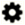

= Icone nell'interfaccia degli elementi
:allow-uri-read: 
:icons: font
:imagesdir: ../media/

[role="lead"]
L'interfaccia del software NetApp Element visualizza icone che rappresentano le azioni che è possibile intraprendere sulle risorse di sistema.

La seguente tabella fornisce un riferimento rapido:

|===

| Icona | Descrizione 

 a| 

 a| 
Azioni

 a| 

 a| 
Backup in

 a| 
image:../media/element_icon_clone.gif["Icona Clona nell'interfaccia utente Web di Element OS"]
 a| 
Clonare o copiare

 a| 
image:../media/element_icon_delete.gif["Elimina l'icona nell'interfaccia utente Web di Element OS"]
 a| 
Eliminare o eliminare

 a| 
image:../media/element_icon_edit.gif["Icona Edit (Modifica) nell'interfaccia utente Web di Element OS"]
 a| 
Modifica

 a| 
image:../media/element_icon_filter.gif["Icona del filtro nell'interfaccia utente Web di Element OS"]
 a| 
Filtro

 a| 
image:../media/element_icon_pair.gif["Icona di associazione nell'interfaccia utente Web di Element OS"]
 a| 
Abbinare

 a| 
image:../media/element_icon_refresh.gif["Icona di refresh nell'interfaccia utente Web di Element OS"]
 a| 
Aggiornare

 a| 
image:../media/element_icon_restore.gif["Icona Restore (Ripristina) nell'interfaccia utente Web di Element OS"]
 a| 
Ripristinare

 a| 
image:../media/element_icon_restorefrom.gif["Ripristina dall'icona nell'interfaccia utente Web di Element OS"]
 a| 
Ripristina da

 a| 
image:../media/element_icon_rollback.gif["Icona di rollback nell'interfaccia utente Web di Element OS"]
 a| 
Eseguire il rollback

 a| 
image:../media/element_icon_snapshot.gif["Icona Snapshot nell'interfaccia utente Web di Element OS"]
 a| 
Snapshot

|===