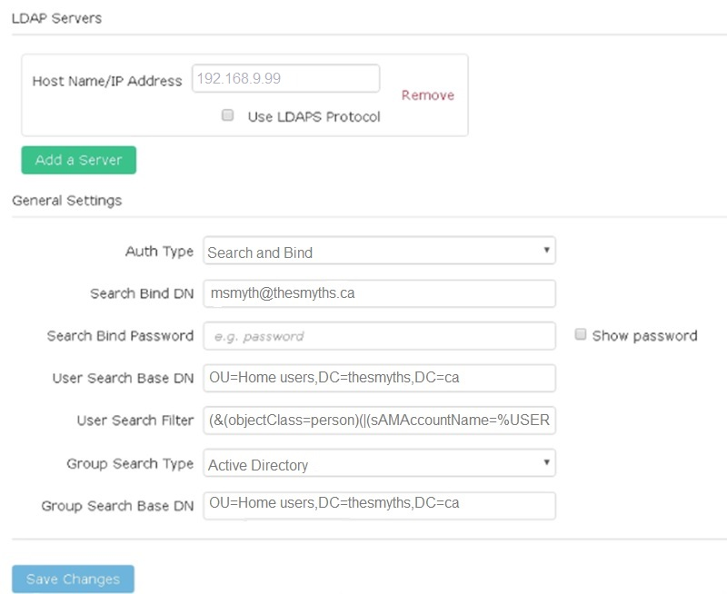

= Abilitare l'autenticazione LDAP con l'interfaccia utente Element
:allow-uri-read: 
:icons: font
:imagesdir: ../media/

[role="lead"]
È possibile configurare l'integrazione del sistema di storage con un server LDAP esistente. Ciò consente agli amministratori LDAP di gestire centralmente l'accesso al sistema storage per gli utenti.

È possibile configurare LDAP con l'interfaccia utente Element o l'API Element. Questa procedura descrive come configurare LDAP utilizzando l'interfaccia utente Element.

Questo esempio mostra come configurare l'autenticazione LDAP su SolidFire e in uso `SearchAndBind` come tipo di autenticazione. Nell'esempio viene utilizzato un singolo Windows Server 2012 R2 Active Directory Server.

. Fare clic su *Cluster* > *LDAP*.
. Fare clic su *Sì* per attivare l'autenticazione LDAP.
. Fare clic su *Aggiungi un server*.
. Inserire il campo *host Name/IP Address* (Nome host/Indirizzo IP).
+

NOTE: È inoltre possibile inserire un numero di porta personalizzato opzionale.

+
Ad esempio, per aggiungere un numero di porta personalizzato, immettere <host name or ip address>:<port number>

. Selezionare *Use LDAPS Protocol* (Usa protocollo LDAPS).
. Inserire le informazioni richieste in *Impostazioni generali*.
+
link:concept_system_manage_manage_ldap.html#view_ldap_details["Dettagli LDAP"]

+

. Fare clic su *Enable LDAP* (attiva LDAP).
. Fare clic su *Test User Authentication* (verifica autenticazione utente) per verificare l'accesso al server per un utente.
. Copiare il nome distinto e le informazioni del gruppo di utenti che verranno visualizzate in seguito per la creazione degli amministratori del cluster.
. Fare clic su *Save Changes* (Salva modifiche) per salvare le nuove impostazioni.
. Per creare un utente in questo gruppo in modo che chiunque possa effettuare l'accesso, attenersi alla seguente procedura:
+
.. Fare clic su *utente* > *Visualizza*.
+
image::../media/element_new_cluster_admin.jpg[element new cluster admin]

.. Per il nuovo utente, fare clic su *LDAP* per tipo utente e incollare il gruppo copiato nel campo Nome distinto.
.. Selezionare le autorizzazioni, in genere tutte le autorizzazioni.
.. Scorrere verso il basso fino al Contratto di licenza con l'utente finale e fare clic su *Accetto*.
.. Fare clic su *Create Cluster Admin* (Crea amministratore cluster).
+
Ora si dispone di un utente con il valore di un gruppo Active Directory.

Per verificare questo, disconnettersi dall'interfaccia utente di Element e accedere nuovamente come utente di quel gruppo.

== Informazioni correlate

* link:concept_system_manage_manage_cluster_administrator_users.html#create_cluster_admin_account["Creare un account amministratore del cluster"]
* link:concept_system_manage_manage_ldap.html#view_ldap_details["Dettagli LDAP"]

